# 🌉 BridgeAI: Dismantling the Invisible Wall of Hiring

**Empowering Marginalized Groups through AI-Driven Merit Translation.**

> "Talent is universal, but opportunity is not." — BridgeAI aims to solve this by translating lived experience into professional power.

---

## 🚀 The Vision
In 2026, the job market still suffers from "Linear Path Bias." Traditional hiring algorithms prioritize prestige, formal degrees, and uninterrupted career paths, effectively silencing the functional labor of millions in marginalized communities—caregivers, community organizers, and grassroots activists.

**BridgeAI** is a visionary career intelligence platform built to fulfill **UN Sustainable Development Goal 10 (Reduced Inequalities)**. It uses agentic AI to translate informal "lived experiences" into high-density professional competency profiles, ensuring that merit is seen, regardless of where it was earned.

---

## 🛠️ Key AI Features (2026 Forward)

### 1. **Voice-to-Apply (Multilingual)**
For users with low digital literacy or English as a second language, the blank page is a barrier.
- **How it works:** Users speak naturally in their native language (Spanish, Tagalog, Vietnamese, etc.).
- **The Tech:** Gemini’s native multilingual reasoning transcribes and translates intent directly into professional English competencies.

### 2. **Story-to-Profile Translator**
A conversational agent that conducts "Empathetic Interviews." 
- **Action:** Instead of a form, users tell stories about how they helped their community.
- **Output:** Structured JSON profiles containing Hard Skills, Soft Skills, and Impact Statements.

### 3. **The Bias Shield Layer**
A revolutionary "Revealed vs. Anonymized" view for recruiters.
- **How it works:** AI proactively redacts demographic markers (age, gender, ethnicity) to ensure the first 5 minutes of any evaluation are 100% merit-based.

---

## 🧠 Agentic Architecture
BridgeAI is powered by five specialized **Agentic Orchestrators** using **Google Gemini 3.0 Pro & Flash**:

1.  **Profile Understanding Agent**: Identifies the 'What' and 'How' in raw conversational narratives.
2.  **Bias-Scrubbing Agent**: Acts as an adversarial filter to strip identity markers.
3.  **Skill Translation Agent**: Maps informal tasks to industry-standard competencies (e.g., "Caregiving" ➔ "Crisis Resource Management").
4.  **Job Matching Agent**: Queries vector databases to match skills over credentials.
5.  **Accessibility Adaptation Agent**: Real-time UI adjustment based on interaction patterns (WCAG 3.0).

### Architecture Diagram

```mermaid
flowchart LR
	A[User Input<br/>(Voice/Text, Any Language)] --> B[Profile Understanding Agent]
	B --> C[Bias‑Scrubbing Agent]
	C --> D[Skill Translation Agent]
	D --> E[Job Matching Agent]
	E --> F[Accessibility Adaptation Agent]

	D --> G((Competency Profile<br/>JSON))
	E --> H((Match Candidates<br/>by Merit))
	F --> I((Adaptive UI<br/>WCAG 3.0))

	style A fill:#1f2937,stroke:#94a3b8,color:#fff
	style B fill:#dbeafe,stroke:#60a5fa,color:#111
	style C fill:#dcfce7,stroke:#34d399,color:#111
	style D fill:#e0e7ff,stroke:#6366f1,color:#111
	style E fill:#ede9fe,stroke:#8b5cf6,color:#111
	style F fill:#fef3c7,stroke:#f59e0b,color:#111
	style G fill:#111827,stroke:#818cf8,color:#fff
	style H fill:#111827,stroke:#a78bfa,color:#fff
	style I fill:#111827,stroke:#f59e0b,color:#fff
```

---

## ♿ Accessibility First (WCAG 3.0)
We believe accessibility is a human right. Our **Adaptive A11y Hub** supports:
- **High Contrast Mode** for visual impairment.
- **Reduced Motion** for vestibular sensitivities.
- **Low Stimuli Mode** for cognitive ease.
- **WCAG Silver Font Scaling** for readability parity.

---

## ⚖️ Ethical AI & Transparency
BridgeAI operates on a **Radical Transparency** model:
- **AI Reasoning Logs**: Recruiters see exactly *why* the AI mapped a story to a specific skill.
- **Human-in-the-loop**: Users have the final edit and "veto" power over every AI-generated skill.
- **Zero Sourcing Bias**: No "prestige ranking"—all candidates start on a level playing field.

### End‑to‑End Workflow

```mermaid
sequenceDiagram
	participant U as User
	participant ST as Story Translator (Chat)
	participant PU as Profile Understanding
	participant BS as Bias‑Scrubbing
	participant STX as Skill Translation
	participant JM as Job Matching
	participant AA as Accessibility Adaptor
	participant R as Recruiter (Blind View)

	U->>ST: Speak/Type lived story (any language)
	ST->>PU: Narrative segments
	PU->>BS: Structured events (What/How/Result)
	BS->>STX: Identity‑redacted data
	STX->>ST: Competency profile (Hard/Soft/Impact)
	STX->>JM: Skills vector
	JM->>R: Merit‑first candidate list
	AA->>U: Adaptive UI (contrast, motion, language)
	R-->>U: Interview/Next‑steps (post‑consent)
```



---

## 📊 Measurable Impact (SDG 10)
- **Skill Discovery Equity**: 100% recognition of informal labor.
- **Zero-Identity Evaluability**: 100% demographic-blind initial sourcing.
- **Economic Mobility Index**: Tracking transitions from "low digital density" areas into professional sectors.

---

## 💻 Tech Stack
- **Frontend**: React 19, Tailwind CSS (WCAG 3.0 Tokens).
- **Intelligence**: Google Gemini API (@google/genai).
- **Deployment**: Edge-optimized with session-persistent A11y preferences.

---

**BridgeAI is not just a job board. It is an equity intervention.**
Built for the 2026 Frontend AI Hackathon.
